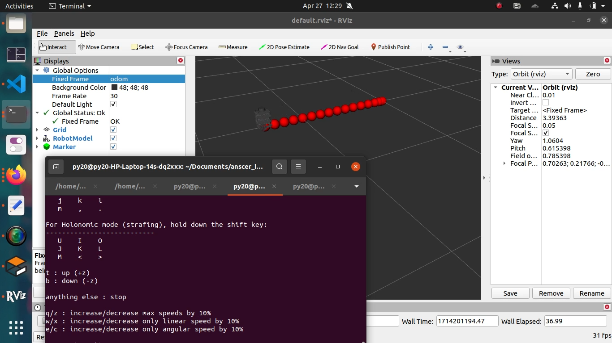

ROS package to visualize and save robot trajectory. Displays Marker objects on Rviz to show points. Creates onemarker for coordinates after every 0.1m displacement, and updates it to a .csv file.

Setup:

Clone the repo

`catkin_make`

`source/devel/setup.bash`

Terminal 1:

`export TURTLEBOT3_MODEL=burger`

`roslaunch turtlebot3_gazebo turtlebot3_empty_world.launch`

Terminal 2:
`roslaunch trajectory_tracker tf.launch`

Terminal 3:
`rosrun trajectory_tracker marker_publisher`

Coordinates are saved in the marker_array.csv file in catkin_ws/

Other commands

`rosrun rviz rviz`

`rosrun teleop_twist_keyboard teleop_twist_keyboard.py`

# Code Explanation

The functionality of this package is the node in the file, "/catkin_ws/src/trajectory_tracker/src/traj_pub.cpp". The node performs the following tasks:

Subscribe to /tf. From the turtlebot3 simulation, read the tranform between /base_footprint and /odom.

Calculate the displacement between current tf value and last-saved value(vector displacement)

If displacement>0.1(10cm), create a new marker with the addItemToMarkerArray function.

Using the functions of fstream cpp library, append this data to "marker_array.csv" by opening with the parameter std::ofstream::app

Loop

## Dependencies

turtlebot3 simulation package

CMakeLists:

roscpp

rospy

std_msgs

visualization_msgs

tf

